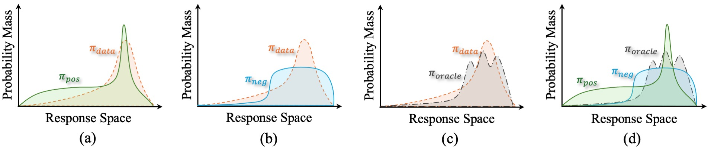

# Dissecting Long Reasoning Models: An Empirical Study

This repo contains code used for experiments in the paper ["Dissecting Long Reasoning Models: An Empirical Study"](https://arxiv.org/abs/2506.04913). 


## News

- [2025/06/06] We released [the paper](https://arxiv.org/abs/2506.04913) and [the codebase](https://github.com/takagi97/Dissect-Long-Reason-Models).


## Introduction



Natural language processing has witnessed a breakthrough in long reasoning capabilities within large language models (LLMs). Unlike previous models depending on chain-of-thought (CoT) prompting, recent models emphasize scaling up inference computation for longer reasoning processes and enabling self-directed behaviors such as speculation, exploration, reflection, and verification.

Achieving such improvement is non-trivial, as it is challenging to construct high-quality supervised datasets that enable models to perform meticulous reasoning. Recent works reveal that scaling reinforcement learning (RL) plays a vital role in this context. Compared to running supervised next token prediction, RL offers two key advantages. First, it eliminates the need for labeled data, enabling training on reasoning tasks without annotated intermediate steps. Second, its supervised signals come from feedback of the model’s own generated responses, promoting the discovery of self-suitable reasoning routes towards correct answers.
% encouraging the discovery of reasoning paths that are well-suited to the model’s internal capabilities and lead to correct answers.

Despite impressive advancements, there exist intriguing questions and counterintuitive phenomena when training and evaluating long reasoning models. In this work, we provide an investigation and analysis of the following three points:

**Role of positive and negative samples:** RL typically optimizes on positive samples with advantages greater than zero, while suppressing negative samples with advantages less than zero. However, it remains unclear what models actually learn from positive and negative samples, and whether learning from negative samples—especially when they correspond to clearly incorrect answers—is necessary. Through systematic ablation on both sample types, we find that positive samples primarily help a model to fit the training data, while negative samples significantly improve generalization and robustness in long CoT reasoning. Surprisingly, we observe that even training solely on negative samples can yield performance comparable to standard RL training.

**Zero advantage problem within GRPO:** We identify a critical limitation of rule-based reward functions in group relative policy optimization (GRPO): when facing overly easy or overly difficult problems, the discrete rewards easily lead to zero advantages, resulting in substantial data inefficiency. Our experiments show that this issue is prevalent in widely used datasets, where gradient elimination occurs in over half of the data. To address this, we explore two straightforward strategies. Specifically, relative length reward (RLR) leverages overly easy samples by assigning additional scores based on relative output length, encouraging more efficient reasoning. Offline sample injection facilitates learning from overly difficult problems by replacing incorrect online samples with correct offline solutions. Experimental results demonstrate that RLR enhances reasoning efficiency without sacrificing overall performance, whereas learning from data beyond the model's capacity remains challenging, even when correct solutions are provided.

**Reason for unstable performance:** Our empirical study shows that performance instability persists across a wide range of reasoning models and benchmarks, regardless of model size or training method. This phenomenon arises from uncertain problems, where neither correct nor incorrect responses have clearly dominant probabilities. While greedy decoding helps output consistency, it might distort evaluation by flipping the correctness of responses. In practice, performing multiple runs still offers a simple yet effective solution to stabilize evaluation scores, particularly on small benchmarks with a high proportion of uncertain problems.

In order to run the experiments that resulted in the findings of the paper, we implemented the following main changes in our fork of verl+DeepScaleR:

1. Support for ablation on positive and negative samples.
2. Support for Incorporating [Luffy loss](https://github.com/ElliottYan/LUFFY/tree/main) and [removing length bias in GRPO](https://github.com/sail-sg/understand-r1-zero).
3. Release our vLLM-based evaluation framework.

## Quick Start
Our code is based on [DeepScaleR](https://github.com/agentica-project/rllm/tree/deepscaler) and [verl (0.3.0.post1)](https://github.com/volcengine/verl/tree/v0.3.0.post1)

```bash
pip install -e verl
pip install -e deepscaler
pip install antlr4-python3-runtime==4.9.3
```

> [!NOTE]
> See requirements for our Python environment.

## Pointers

### Scripts

- [Training scripts (scripts/train)](scripts/train)
- [Evaluation scripts (scripts/eval)](scripts/eval)

Note that models in Section 3 are trained based on SFT-based models: DeepSeek-R1-Distill-Qwen-1.5B and -7B, while experiments in Section 4 are conducted on an RL-trained models: DeepScaleR-1.5B-Preview.

### Datasets

- [Training datasets (data/train)](data/train)
- [Evaluation datasets (data/eval)](data/eval)

### Our main changes to the code:

*Incorporate DeepSacleR Reward Function*

- verl/verl/trainer/main_ppo.py
- verl/verl/workers/reward_manager/deepscaler.py

*Ablation Study on Positive/Negative Samples*

- verl/verl/trainer/ppo/ray_trainer.py

*Incorporate Luffy Loss and Remove Length Bias in GRPO*

- verl/verl/trainer/ppo/core_algos.py

We have developed an evaluation framework based on vllm and still adopt the verification method of Deepscaler.

*Evaluation Framework*

- scripts/eval/vllm_general_reasoning_test.py

## Acknowledgements

We extend our sincere gratitude to Verl, vLLM, DeepSpeed, Qwen, and DeepSeek R1 for their contributions. We are also deeply thankful to the many others who have supported us throughout this work, even if they are not individually acknowledged here.

## Citation

If you find our work helpful, please kindly cite us as:

```bibtex
@misc{mu2025dissectinglongreasoningmodels,
      title={Dissecting Long Reasoning Models: An Empirical Study}, 
      author={Yongyu Mu and Jiali Zeng and Bei Li and Xinyan Guan and Fandong Meng and Jie Zhou and Tong Xiao and Jingbo Zhu},
      year={2025},
      eprint={2506.04913},
      archivePrefix={arXiv},
      primaryClass={cs.LG},
      url={https://arxiv.org/abs/2506.04913}, 
}
```